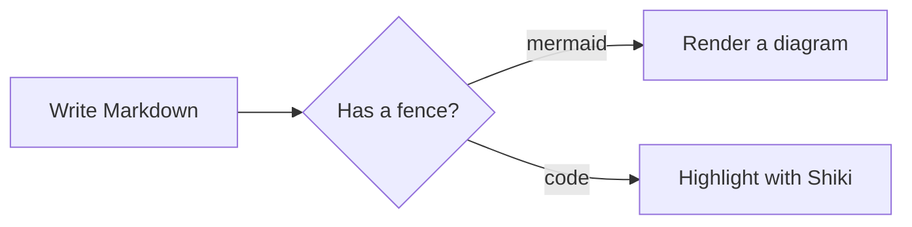
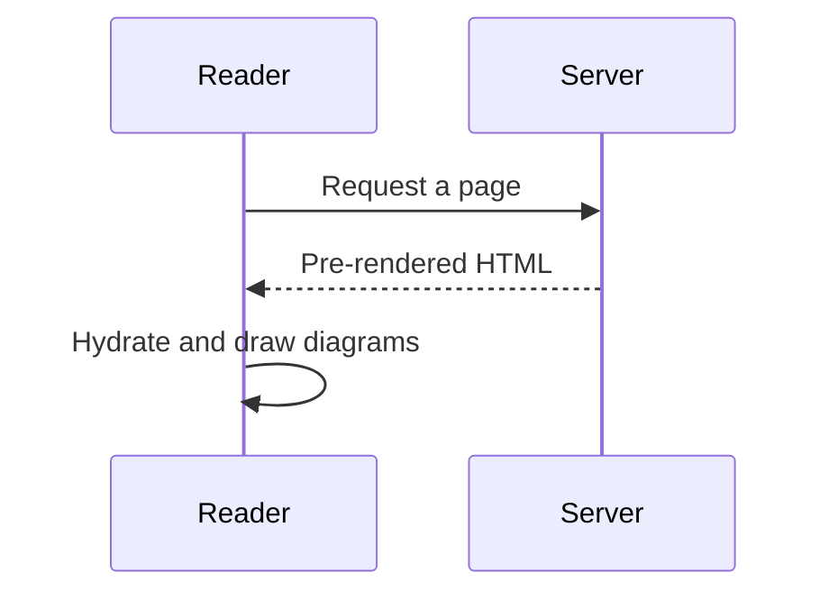

# Diagrams

Write a fenced code block with the `mermaid` language and it renders as a
diagram. Diagrams are drawn in the browser and follow your light or dark theme.

## Flowchart

````md

````

Renders as:


## Sequence



Anything Mermaid supports works, including class diagrams, state diagrams, and
Gantt charts. See the [Mermaid docs](https://mermaid.js.org) for the full syntax.
